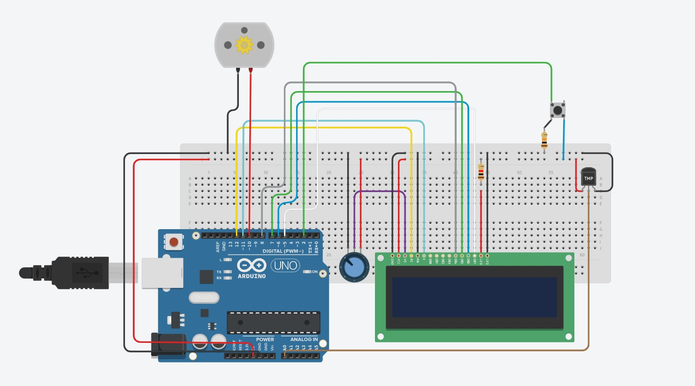

# Automatic Fan
## AIM:
Temperature Controlled Fan Simulation In Tinker Cad

## Purpose:
To Start the Fan as the Temperature Is Ceratain Temperature is Reached. Also Increse the Fan Speed as the Temperature rises.

## Short Description:
**Requirements:**
- Arduino UNO
- LCD 16X2
- Temperature Sensor (TMP36)
- Potentiometer (50 Kohm)
- Fan
- Push Button
(Tinkercad can also be used)

## Workflow:
- First we initialise TMP36 PIN, Fan Pin.
- We initiate a Conditional statement For the Fan to Start as temperature increases.
- A Resistor (1 Kohm) is added For the LCD and Resistor (10 Kohm) to the push button.

In this circuit we are maintaing the room temperature between 30-45 C using motor. If the temperature is lower than 30 C then Fan will turn on. Once the temperature gets Low it will turn off User can set the range of room temperature by changing in the code.

## Setup instructions:
- Assemble the circuit as shown below.
- Open Tinker Cad on any browser and make the circuit as shown here.
- Then paste the code in code section.
- Open the Serial Monitor.
- Start Simulation.
- Upload the code provided [here]()
- Run to see the project in action!
------------
## Output:
[Simulation Video](./Images/preview.mp4)

------------

## Author:
[DragonUncaged](https://github.com/dragonuncaged)
